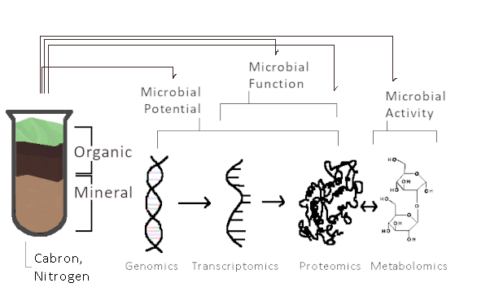
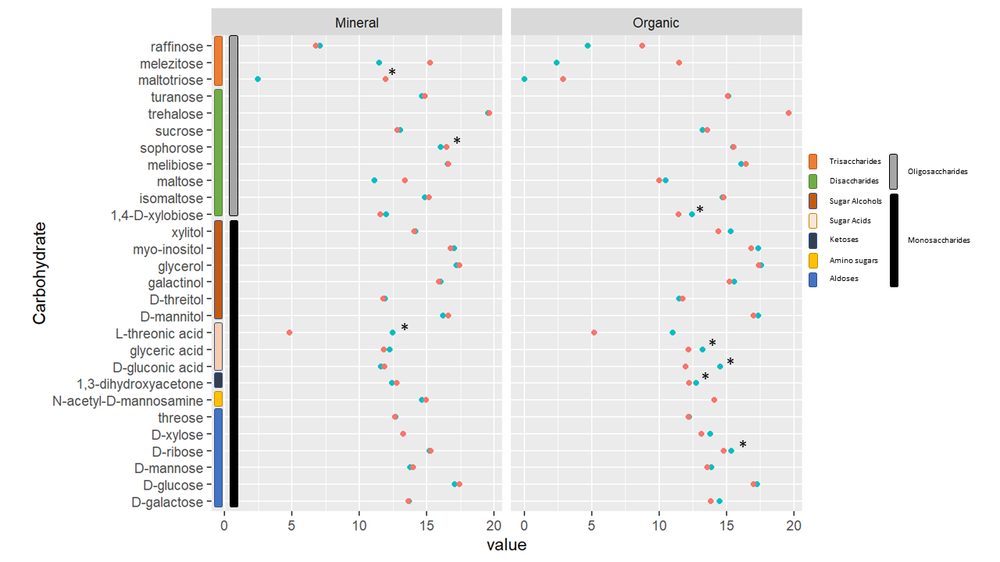
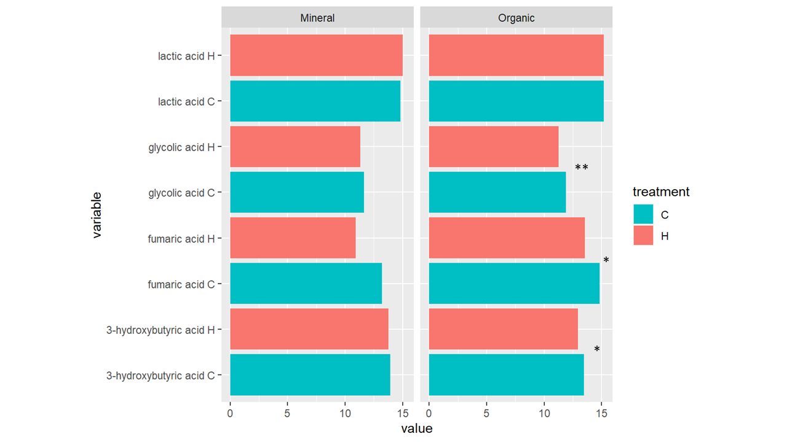
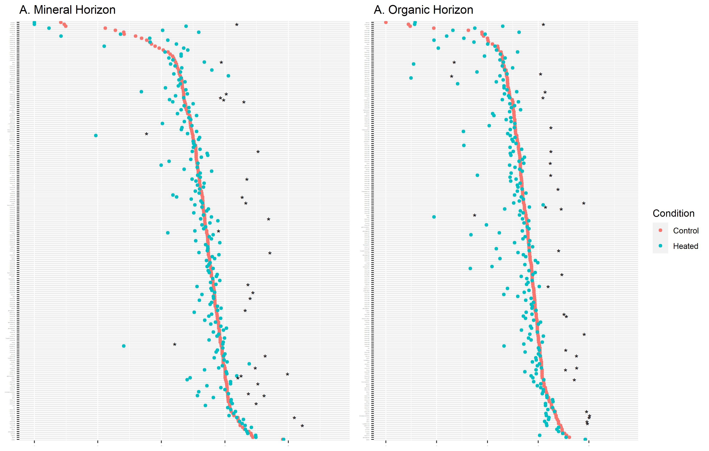

```{r setup, message = FALSE, warning = FALSE}
library(knitr)
opts_chunk$set(fig.align = "center")
library(readr)
library(tidyverse)
library(ggplot2)
library(ggpubr)
library(readxl)
library(DT)
```
<div style="line-height: 2em;">
# Abstract

Metabolomics holds potential in understanding the mechanisms behind metabolic fluctations caused by climate change in the terrestrial soil, an environment known to be extremely inaccessible for omic analysis. Fortunately, 211 metabolites were successfully identified via gas chromatography mass spectrometry and 202 lipids were successfully identified via liquid chromatography tandem mass spectrometry of soil samples from the Harvard Forest Project, a longitudinal study where terrestrial forest soil has been treated with heat 5 degrees Celsius above ambient since 1991. An overall depletion of metabolites and lipids in both soil horizons, organic and mineral, were exhibited. There appeared to be fluctuations of metabolic activity specific to soil horizon with higher levels of variability within the organic layer, which may be due to the different compositions of plants and microbes. Further investigation on specific metabolites significantly (p<0.05) affected, such as sophorose and amino acids are warranted as they may indicate adaptations to the use of recalcitrant carbons as a nutrient source by terrestrial microbes. 

##### Keywords: Metabolomics, Lipidomics, Terrestrial Soil, Heat Treatment

# Introduction

The projected course of climate change indicates an increase in temperature of up to 5 degrees Celsius by 2100 [@oneill_scenario_2016]. It is an immediate risk to all environments including terrestrial soil, home to a diverse range of microorganisms that are yet to be fully discovered due to technological limitations [@classen_direct_2015].	Thus far, an increase in temperature by 5 degrees Celsius has been found to alter terrestrial soil microbial diversity and abundance in both horizons, Organic and Mineral, according to the longitudinal study performed at the Harvard Forest since 1991 [@rodriguez-reillo_long-term_2021]. 

The terrestrial plots in the Harvard Forest have undergone continuous heat treamtent since 1991 using wire coils and have continuously been monitored [@melillo_soil_2011; @deangelis_long-term_2015; @rodriguez-reillo_long-term_2021]. Samples extracted in 2008 indicated a negative relation between mean annual temperature and root respiration [@burton_adjustment_2008]. The authors concluded the lowered metabolic activity (aka root respiration rate) could be due to either decreases in metabolic capacity or moisture levels [@burton_adjustment_2008]. Harvard Forest analyses also indicated a negative relation between increased temperature and carbon use efficiency which is due to the increasing energy cost of maintaining existing biomass [@li_reduced_2019]. By 2011, after 20 years of heat treatment, there was a significant alteration to the microbial diversity within the Organic horizon, specifically the individual members of the Actinobacteria, Alphaproteobacteria and Acidobacteria [@deangelis_long-term_2015]. The bacterial communities began to resemble mineral soils and was strongly driven by decreased abundance of a few dominant taxa [@deangelis_long-term_2015]. 

FTICR-MS data from 2017 samples indicated a transformation of carbon from the organic to the mineral horizon with carbon abundance decreasing by 13% in the organic horizon and increasing by 17% in the mineral horizon [@rodriguez-reillo_long-term_2021]. Metatranscriptomic data of the mineral horizon indicated a shift in diversity with an increase in Actinobacteria, Ktedonobacteria, and Alphaproteobaceria along with a decrease in acidobacteria, Betaproteobacteria, Gammaproteobacteria, Leotiomycetes (FDR<0.1), and Agaricomycetes (FDR<0.1) [@rodriguez-reillo_long-term_2021]. The organic horizon similarly indicated a statistically significant (FDR<0.1) increase in Actinobacteria, Thermoleophilia, and Ktedonobacteria along with a statistically significant (FDR<0.1) decrease in Leotiomycetes, Sordariomycetes, and Agaricomycetes [@rodriguez-reillo_long-term_2021]. 

Metabolomics holds potential in supplementing the identified differential levels of carbon compounds and diversity and may help in understanding the possible decrease in metabolic activity and efficiency within these extremely inaccessible micro-environments. As a research assistant within the Blanchard Laboratory, I had the opportunity to analyze the 2017 metabolomic and lipidomic data. As a result, it was necessary, as a researcher, to understand the context of the metabolomic data. This thesis therefore aims to understand the field of metabolomics and to uncover the compounds affected by heating in the terrestrial soil in 2017. Unconventionally, the manuscript will include R code utilized for statistical analysis and visualization. 

## Literature Review

A literature review on metabolomics was performed on the 14 free full text articles published within the last five years based on a Pubmed search of ["Non-targeted metabolomics soil NOT gut"](https://pubmed.ncbi.nlm.nih.gov/?term=Non-targeted+metabolomics+soil+NOT+gut&filter=simsearch2.ffrft). A literature review on lipidomics was additionally performed on the 18 free full text articles published with the last five years based on a Pubmed search of ["lipidomics soil"](https://pubmed.ncbi.nlm.nih.gov/?term=lipidomics+soil&filter=simsearch2.ffrft&filter=years.2016-2021). Additional articles referenced by these full texts were reviewed.

### Omics

The field of omics consists of the well understood study of genomics and transcriptomics as well as the less understood study of proteomics and metabolomics (Figure 1) [@w_irvine_overview_2019; @nicora_mplex_2018]. Integrative omic approaches have proven to be beneficial in aquatic settings and human disease [@larras_multi-omics_2020; @jaiswal_systems_2020] and is increasing in popularity in soil environments, the most complex microbial system known to date [@nicora_mplex_2018]. 

Metabolomics can further be subclassified, based on metabolite properties, into metallomics, lipidomics, and polar metabolomics [@w_irvine_overview_2019]. Metabolomics in ecology is not well understood due to the difficulty of metabolite extraction from entire communities, like terrestrial soil, compared to single organisms like human and bacteria as an entire community logically contains an exponentially larger set of diverse metabolites compared to single organisms  [@w_irvine_overview_2019]. Nonetheless, recent efforts have been made to improve the extraction, analysis, and incorporation of metabolomics into the understanding of the complex biomolecular functions within entire communities [@miller_non-targeted_2019; @swenson_linking_2018]. Different extraction methods include liquid chromatography and gas chormatography as well as continuous flow isotope ratio and isoprime with analysis via mass spectrometry [@rodriguez-reillo_long-term_2021; @llorens_priming_2016]. DIfferent extraction methods result in different metabolite profiles, thus, methodology is a significant confounder in studies that aim to identify biomarkers or differential levels of metabolic activity [@miller_non-targeted_2019]. 

<center>

{width=50%}

</center>

### Non-targeted Metabolomics

Non-targeted metabolomics is a useful analytical tool to understand metabolite profiles of species such as plants and animals [@fernandez_metabolomic_2019; @oromi_differential_2017; @behr_metabolic_2017; @chaparro_metabolomics_2018]. Additionally, and arguably more importantly, non-targeted metabolomics helps identify biochemical mechanisms within species or environments such as plants and bacteria that play significant roles in pathogen response and adaptation to external changes within the rhizosphere, the narrow region of soil that is directly affected by root exudation [@miller_non-targeted_2019; @swenson_linking_2018; @mhlongo_concurrent_2020] and in varying substrates like clay, sand, soil, and "farm 4 soil" conditioned soil [@miller_non-targeted_2019; @pahalagedara_antimicrobial_2020]. For example, ultra-high performance liquid chromatography (UHPLC) of pathogen-inoculated *Sorghum bicolor* primed with growth-promoting rhizobacteria enhanced levels of amino acids (tyrosine, tryptophan), phytohormones (jasmonic acid and salicylic acid conjugates, and zeatin), and defence-related components of the lipidome [@tugizimana_unravelling_2019]. Non-targeted gas chromatography-time-of-flight mass spectrometry within the rhizosphere of Cadmium-stressed *Sedum plumbizincicola* identified 33 differentially expressed metabolites [@sun_analysis_2020]. Cadmium stress inhibited the secretion of malic acid, glycolic acid, glutaric acid, and other organic acids in the roots of *S. plumbizincicola* which indicates that the stress may reduce organic acid release in roots to reduce the activation of Cadmium, thereby reducing the dissolution, absorption, and transport of Cadmium in plant tissues and reducing the damage to the plants [@sun_analysis_2020]. Continuous flow isotope ratio mass spectrometry and isoprime mass spectrometry  within Citruses inoculated with pathogen *Alternaria alternata* identified a metabolite profile change of 200 metabolites mostly related to the mevalonic and liolenic pathways as well as localization of hexanoic acid to the roots which supports signs of pathogen resistance [@llorens_priming_2016]. Hydrophilic interaction liquid chromatography (HILIC)–mass spectrometrywithin enriched farming soil compared to control soil indicated antimicrobial properties within this conditioned medium [@pahalagedara_antimicrobial_2020]. Of the 7 significant metabolites identified, tryptamine, and 2-hydroxyisocaproic acid indicated antimicrobial activity [@pahalagedara_antimicrobial_2020]. Non-targeted ultra-high-performance liquid chromatography quadrupole time-of-flight mass spectrometry within tomato plants inoculated with *P. capisici* revealed a well-documented phytohormone responsible for resistance induction following pathogen infection, salicylic acid, and its volatile derivative methyl salicylic acid, were more abundant in the stem and leaf after pathogen inoculation [@mhlongo_concurrent_2020]. In hypoxic conditions, *Suaeda maritima*, a halophyte found in wetlands, showed an increased level of tricarboxylic acid (TCA)-cycle intermediates such as succinate, malate and citrate based on analysis of high-performance liquid chromatography and H-NMR spectra [@behr_metabolic_2017].

In a study on crop quality that utilized metabolomics and genomics, the obstacle-group of ramie (Boehmeria nivea L. Gaud) showed decreased levels of *Rhizobiaceae* (commonly indicative of plant elongation), *Lysobacter antibioticus* (commonly indicative of plant defense), and *Bradyrhizobium japonicum* as well as increased levels of *Azospirillum lipoferum* and *A. brasilense*. Gas chromatography mass spectrometery identified differential levels of  cysteinylglycine (Cys-Gly), uracil, malonate, and glycerol [@wang_identification_2020]. These findings indicate an inhibition of IAA, an auxin that promotes plant elongation, and decreased plant defense because the metabolites identified are speculated to be mediators for *L. antibioticus* [@wang_identification_2020]. 

Arabidopsis thaliana, a plant found on the shoulders of roads and in disturbed land, 

non-targeted reversed-phase ultraperformance liquid chromatography electrospray ionization quadrupole-time-of-flight mass spectrometry indicated phosphate deficiency depleted metabolite abundance in the rhizosphere, indicating P5-type ATPase, which utilizes phosphate, is affected [@ziegler_non-targeted_2016]. 

### Developing Lipidomics

Lipidomic analyses, similar to other metabolomic analyses mentioned previously, are helpeful methods for biomarker identification in species including humans [@zarate_significance_2017] and other animals as well as plants and microbes [@nicora_mplex_2018; @wang_quantitative_2020]. Lipid variations within chain length, side chain composition, and degree of saturation are important identifiers of lipids, and due to the amount of variability, extraction and identification is extremely difficult, which is the reason behind the field of lipidomics being technologically behind compared to genomics and metabolomics [@pham_targeting_2019]. Recent literature, therefore focuses on improving lipid extraction and analysis methods rather than application and comprehension [@pham_targeting_2019]. For example, a 2019 lipidomics methodology of using the combination of hydrophilic interaction and C30 reversed-phase chromatography with mass spectrometry improved the resolution of the isomers of corn roots as well as identification of acylphosphatidylglycerol in corn roots for the first time [@pham_targeting_2019]. Liquid chromatography tandem mass spectrometry identified over 500 lipids and 18 lipid classes and their differential levels within various tissue types inoculated with the procine parasite, *Ascaris suum* [@wang_quantitative_2020].

The classes of lipids are the following: fatty acyls (FA), glycerlipids (GL), glycerophospholipids (GP), Sphingolipids (SP), Sterol Lipids (ST), and Prenol Lipids (PR) [@fahy_lipid_2011].

# Methods

14 soil samples were collected on May 24, 2017 from the organic and mineral horizons of the Barre Woods long-term experimental warming and control plots located at the Harvard Forest Long Term Ecological Research (LTER) site in Petersham, MA. Fourteen soil cores were collected from subplots within the larger 30x30 meter plots.  The experimental site has been further explained in previous publication [@melillo_soil_2011].

## Metabolite Extraction

The metabolomes of the Harvard Forest soil samples were analyzed as described previously [@rodriguez-reillo_long-term_2021]. Briefly, metabolites were extracted with MPLEx protocol by adding solvent mixture (chloroform and methanol) to the ten grams of soil sample with nanopure water amended. After the extraction, aqueous layer liquid was transferred to a new glass vial. They were completely dried in a Speed-Vac concentrator (CentriVap, LABCONCO, Kansas City, MO) and chemically derivatized for GC-MS analysis using Agilent 7890A gas chromatograph coupled with a 5957C mass spectrometer (Agilent Technologies, Inc. Santa Clara, CA). All the samples were analyzed within 24 hr after derivatization. The processing order was randomized both for the derivatization and the GC-MS analysis. All the collected mass spectrometer data files were converted to netCDF format and processed using Metabolite Detector [@hiller_metabolitedetector_2009]. All the peaks were matched to PNNL’s augmented version of metabolomics database, which has retention index and fragmented spectra of metabolites and additionally cross-checked with NIST17 GC-MS spectral database [@kyle_resource_2021]. Identification of detected metabolites was validated manually to avoid misidentification of metabolites or false positive and negative errors. 

## Lipid Extraction

For untargeted lipidomic analyses, the lipids extracted were reconstituted in methanol prior to analysis using liquid chromatography tandem mass spectrometry (LC-MS/MS), as previously described (PMID: 28158427).  Briefly, a Waters Acquity UPLC H class system interfaced with a Velos-ETD Orbitrap mass spectrometer was used for LC-MS/MS analyses.  10 μl of reconstituted sample was injected onto a Waters CSH column (3.0 mm x 150 mm x 1.7 μm particle size) and separated over a 34-minute gradient (mobile phase A: ACN/H2O (40:60) containing 10 mM ammonium acetate; mobile phase B: ACN/IPA (10:90) containing 10 mM ammonium acetate) at a flow rate of 250 μl/minute. Eluting lipids were introduced to the MS via electrospray ionization in both positive and negative modes, and lipids were fragmented using higher-energy collision dissociation (HCD) and collision-induced dissociation (CID) (PMID: 28158427).  Lipids will be identified using the software LIQUID (PMID: 28158427).  Each identification was manually validated by examining the MS/MS spectra for fragments that match the identified lipid including diagnostic ions as well as associated chains. The isotopic profile, extracted ion chromatogram, mass measurement error, and elution time are also examined for high level confidence in the identification. All raw mass spectrometry data set files were aligned and gap-fill using the identified lipid name, observed m/z, and the retention time from each analysis.  This is achieved by aligning all datasets (grouped by ionization type) and matching unidentified features to their identified counterparts using MZmine2 (PMID: 20650010).  Aligned features were manually verified and peak intensity values exported for statistical analysis.

## Identification and Statistical Analysis

The Kyoto Encyclopedia of Genes and Genomes (KEGG), a set of accessible online databases that encompasses a broad range of genes, genomes, pathways, and metabolites consist of compounds, metabolites and lipids, by class and subclass (Kanehisa, 2000). Metabolites and Lipids were matched to the KEGG database using the R packages KEGGREST from Bioconductor, an open access bioinformatics software, and KEGGdata, a JGS internal R package.

Data was then normalized by median and log transformed (tidyverse), statistically analyzed via t-test  (p< 0.05) (base R), and visualized (ggplot and ggpubr) to understand the overall trend of lipid and metabolite abundance. MetaboAnalyst 5.0 statistical analysis was utilized to visualize Self-organizing map (SOM) clustering and K-means concordance plots of the data normalized by median, log transformed, and was auto-scaled with mean-centering and dividing by the standard deviation of each plot. 

## Metabolite Mapping

Metabolites were mapped as networks by horizon using the MetScape Pearson Correlation Calculator designed for metabolomic data, in which medians were used for fold change to account for possible outliers. The correlations were then mapped in Cytoscape.

# Results

## Metabolome

211 unique metabolites were extracted (Table 1), statistically analyzed, and mapped (Figure 2). 83 were identified by the internal metabolite database, 71 of which were successfully matched to the KEGG database [@kanehisa_kegg_2000]. The 71 matched metabolites consisted of 28 carbohydrates, 2 lipids,  4 nucleic acids, 4 organic acids, 16 amino acids, 1 amine (ethanolamine), and one water-soluble vitamin (nicotinic acid). 116 and 169 out of the 211 compounds had an average fold change (normalized log(C/H)) of more than one within the mineral layer and organic layer, respectively (Figure 3). Self-organizing map and K-means clustering of normalized metabolomic data indicates more distinction between treatments within the mineral horizon compared to the organic horizon (Supplemental Figure 3).

```{r, echo=FALSE, message=FALSE}
EMSL_PNNL <- read_csv("Tables/metabolite_EMSL_PNNL.csv") %>% 
  rename("Table 1. Metabolites" = Metabolite)
rmarkdown::paged_table(EMSL_PNNL)
```

```{r map, echo=FALSE, out.width="70%", fig.show="hold", message=FALSE, warning=FALSE, fig.cap="**Figure 2. Mapped metabolites of the (top) Organic and (bottom) Mineral Horizons.** Downward fold changes are blue and upward fold chages are red. Statistically significant metabolites (p-value < 0.05) are indicated with purple outlines with more prominently purple outlines being more significant."}
include_graphics(c("Figures/OrganicNetworkv6.png", "Figures/MineralNetworkv5.png"))
```

Within the mineral horizon, 19 compounds were significantly (p<0.05) depleted with heat treatment: 3 uncategorized compounds: galacto-hexodialdose, 3-amino-2-piperidone, and dehydroalanine, 12 peptides which were all L-enantiomers with glycine being the exception, three carbohydrates: L-threonic acid, maltotriose, and sophorose, and one nucleic acid: thymine (Figure 4A). 

Within the organic horizon, 20 compounds were significantly (p<0.05) lowered as well: 4 uncategorized compounds: 3-amino-2-piperidone, beta-cyano-L-alanine (GABA), arbutin, porphine, 6 carbohydrates: D-gluconic acid, glyceric acid, 1,3-dihydroxyacetone, melezitose, 1,4-D-xylobiose, D-ribose, 3 Organic acids: glycolic acid, 3-hydroxybutyric acid, fumaric acid, 6 peptides all being L-enantiomers with glycine and beta-alanine being the exceptions, and one vitamin: nicotinic acid (Figure 4B). 22 unknown metabolites were identified to be statistically significant among both horizons (Figure 4). 

```{r, message=FALSE, warning = FALSE, fig.cap = "**Figure 3. Metabolite Class standardized abundance."}
# using ggplot2 and dplyr to display all 211 in both treatments within both horizons
## Import data
metabs <- read_csv("Tables/metabolite_all_pvalues_foldchange_KEGG.csv")[,-c(1,4:8)] %>%
  mutate(metabplot = gsub(".*_", "", metabplot))
```
```{r, message=FALSE, warning=FALSE, fig.cap="**Figure 3. Metabolites in heated and controled treamtents in both horizons.** Metabolomic data indicate a differential abundance between the heated and control groups within the (A) Mineral and (B) Organic horizons. Significant metabolites (p-value < 0.05) are indicated by triangles."}
## Factors for ggplot with control plots decreasing in abundance across x variable
source("Functions.R")
GGMetabolite(data = metabs, meanC = "meanC", meanH = "meanH", treatment1 = "O", treatment2 = "M", xlabel = "Metabolites")
```


## Lipidome

192 unique lipids were identified from liquid chromatography tandem mass spectrometry. The lipids identified can be categorized into four groups: prenols, sphingolipids, glycerophospholipids, and glycerolipids (Table 2, Supplementary Lipid Map 1, Supplementary Lipid Map 2). 288 of the lipids exhibited a lower abundance in the heated treatment. 28 lipids were significantly (p < 0.05) depleted and consist of 21 out of the 94 Glycerolipids, 5 out of 89 identified Glycerophospholipids, and 2 of the 4 Sphingolipids (Hexosyl Ceramides). Additionally, of the 96 lipids exhibiting an increase in abunance with treatment, 3 were statistically significant (p < 0.05): 2 Glycerolipids and 1 Glycerophospholipid. 

```{r}
Lipids <- read_excel("Tables/combined.xlsx") %>%
  mutate(Subclass = gsub("\\(.*", "", row.identity)) %>%
  mutate(Subclass = gsub("[0-9]", "", Subclass)) %>% group_by(class) 
Summary_Lipids <- Lipids %>% summarise(lipids=n())
kable(Summary_Lipids,
      caption="Table 2. Summary of Number of Lipids by Class")
```

```{r, message=FALSE, warning = FALSE}
lipid_average_data <- read_csv("Tables/lipid_average_data.csv")[-c(1,9,10)] %>% arrange(Pvalues) %>% separate(Metabolite, c("row.identity", "treatment"), sep = "\\.") %>% arrange(treatment)
L <- merge(lipid_average_data, Lipids[,c(1,2,30)]) %>% arrange(treatment, class, Subclass, Pvalues) %>% relocate(row.identity,class, Subclass)
sig.L <- L %>% arrange(Pvalues) %>% filter(Pvalues < 0.05) %>% arrange(class, Subclass)
Lipid.t.classes <- L %>% select(row.identity, class, Subclass, treatment, Control, Heated) %>% group_by(treatment, Subclass) %>% mutate(p = t.test(Control, Heated)$p.value)
```

# Discussion

## Metabolites

Levels of metabolite groups are important markers for microbial activity [@miller_non-targeted_2019]. For example, within the organic horizons, root exudation of carbohydrates have been indicative of microorganism recruitment while exudation of amino and organic acids may recruit specific microorganisms that promote plant growth [@miller_non-targeted_2019; @yang_relation_2015]. Additionally, specific metabolites are indicative of certain metabolic functions like Tryptamine and 2-hydroxyisocaproic acid having antimicrobial properties within soil anaerobes (i.e. Clostridium spp.) [@pahalagedara_antimicrobial_2020]. Within the organic horizon, heat treatment led to a decrease in every metabolite group except carbohydrates (Figure 5).

```{r}
metab.clean <- metabs[,c(1,12,5,8,10,16:18)] %>% gather(treatment, value, c(meanC, meanH))  %>%   mutate(treatment = gsub("meanC", "C", treatment)) %>% mutate(treatment = gsub("meanH", "H", treatment)) %>% mutate(x = paste(Class, treatment)) %>% mutate(x = fct_relevel(x, "Carbohydrates C", "Carbohydrates H", "Peptides C", "Peptides H", "Nucleic acids C", "Nucleic acids H", "Organic acids C", "Organic acids H", "Lipids C", "Lipids H", "Vitamins and Cofactors C", "Vitamins and Cofactors H"))
figures <- metab.clean %>% mutate(variable = paste(Metabolite, treatment))
```
```{r, fig.cap="**Figure 5. Metabolite abundance by sublcass.** Carbohydrate total abundance increases in both horizons while every other subclass of metabolites decreases in both horizons."}
ggplot(subset(metab.clean, !is.na(Class)), aes(x, y=value,fill=Metabolite)) + geom_bar(stat="identity") + coord_flip() + theme(legend.position = "none") + facet_grid(~Horizon) + xlab("Metabolite")
```

### Carbohydrates

```{r, message=FALSE, warning = FALSE}
Carbs <- figures[which(figures$Class=="Carbohydrates"),] %>% arrange(Horizon, treatment,Subclass_1, Subclass_2)
rmarkdown::paged_table(Carbs)
# Carbs %>% select(Metabolite, Horizon, Subclass_1, treatment, value) %>% spread(Subclass_1, value) %>% group_by(Horizon) %>% mutate(p.value = t.test(Monosaccharides, Oligosaccharides)$p.value)
Carb.M <- Carbs %>% filter(Horizon == "Mineral")
Carb.O <- Carbs %>% filter(Horizon == "Organic")
```

Sugars provide energy to microorganisms and are signaling agents for plants [@miller_non-targeted_2019; @behera_microbial_1974; @trouvelot_carbohydrates_2014]. The total abundance of carbohydrates increased in a statistically negligent amount in both the organic (p=`r t.test(Carbs[c(57:84),8],Carbs[c(85:112),8])$p.value` and mineral (p=`r t.test(Carbs[c(1:28), 8],Carbs[c(29:56),8])$p.value`) horizons [@rodriguez-reillo_long-term_2021]. 

Within the Mineral horizon, though, L-threonic acid significantly decreased (p = 0.004) while maltotriose and sophorose signficantly increased (p = 0.012 and p = 0.028). Within the Organic horizon, D-gluconic acid, glyceric acid, 1,3-dihydroxyacetone, 1,4-D-xylobiose, and D-ribose significantly decreased (p < 0.05) while melezitose significantly increased (p = 0.04).

Nearly all carbohydrates that exhibited an increase in abundance when treated with heat were oligosaccharides in both horizon, more notably in the Organic horizon (Figure 6). There was statistically significant difference between the monosaccharides and the oligosaccharides, but this trend of increased abundance of larger carbohydrates may be indicative of a shift to optimizing mineralization of recalcitrant carbons over labile carbons [@zhang_changes_2018].

```{r}
# how I made the ggplot of carbs
#ggplot(Carbs, aes(factor(Metabolite, levels=unique(Metabolite)), value, color=treatment)) + geom_point(stat="identity") +theme(legend.position = "none") + coord_flip() +facet_grid(~Horizon) + xlab("Carbohydrate") + scale_color_manual(values = c("#00BFC4","#F8766D"))
```


#### Sophorose

Sophorose, a disaccharide, is known to induce cellulase which decomposes cellulose in fungi and bacteria [@behera_microbial_2017]. The significantly increase in abundance in the mineral horizon may be indicative of an increase in microbes that are able to decompose cellulose, a recalcitrant carbon nutrient that are less accessible than labile carbons [@behera_microbial_2017]. Whether the soil is adapting to utilize recalcitrant carbons as a nutrient source can be tested using substrate addition studies previously described in the Harvard Forest soil [@deangelis_long-term_2015].

#### Trehalose

Prior to normalization, metabolomic data indicated noticeably high levels of glycosyl gly and trehalose compared to the other compounds (Supp. Figure 1). Trehalose, a disaccharide, has been found as the main compatible solute in almost any rhizobial strain tested, and its accumulation has been detected in free-living cells, bacteroids, and nodules as a key compound for signaling plant growth, yield and adaptation to abiotic stress such as drought, high salinity and extreme temperatures [@miller_non-targeted_2019], and its manipulation has a major agronomic impact on leguminous plant [@reina-bueno_role_2012]. The  concentration of trehalose correlates with desiccation resistance in certain studied soil microbes (i.e. E. Coli and R. etli) [@zhang_correlation_2012; @reina-bueno_role_2012]. Whether resistance to desiccation is exhibited in the terrestrial soil in both treatments of this study is unknown and further investigation is warranted. 

### Amino Acids

Plot M_H_32_AB of the mineral horizon of the heated treatment group is significantly higher in amino acid abundance than the other mineral heated plots and is most likely due to varying success of metabolite extraction. There is a possibility this is due to high levels of activity within the singular plot but differential levels of diversity within the mineral horizon plots were not observed within the FTICR-MS and metatranscriptomic data. The organic horizon had a larger range of amino acid variability compared to the mineral horizon within the heated treatments which may be indicative of higher variability in the levels of metabolic activity and therefore microbial activity (Figure 4). This is representative of the overall metabolite abundance variability 

Amino acids are a nitrogen nutrient vital for soil environments along with ammonium and nitrate [@paungfoo-lonhienne_plants_2008]. Ammonium and nitrate levels were analysed on these soil samples and were found to be significantly depleted in the organic horizon (p < 0.05) (Supplemental Figure 2). These findings along with the trend of amino acid depletion is indicative of increased nitrogen mineralization, a finding also identified by Rodriguez-Reillo et al. 2021.
<center>

{width=50%}

</center>
L-amino acids (e.g., L-Leu, L-Phe, L-Ala, L-Ile, and L-Pro) inhibit the growth of bacteria and biosynthesis of IAA, an auxin that causes plant elongation, in soil [@wang_identification_2020]. Of the 16 amino acids identified in the soil, 6 and 12 were statistically significant in the organic and mineral horizon, respectively. Most notably in the mineral horizon, L-leucine and L-isoleucine indicated a log2 fold change (Control/Heated) of 0.29 (p=0.0000606) and 0.16 (p=0.0000998) (Figure 9). 

```{r, fig.cap = "**Figure 8. Amino acid levels.** Both the Mineral and Organic horizons indicate a depletion of all amino acids."}
rmarkdown::paged_table(metab.clean[which(metab.clean$Subclass_1=="Amino acids"),])
AA <- figures[which(figures$Subclass_1=="Amino acids"),] %>% arrange(Subclass_2, p)
ggplot(AA, aes(factor(Metabolite, levels=unique(Metabolite)), value, color=treatment)) + scale_color_manual(values = c("#00BFC4","#F8766D" )) + geom_point(stat="identity") + coord_flip() +facet_grid(~Horizon) + xlab("Amino Acid")
AA.Mineral <- AA[which(AA$Horizon=="Mineral"),]
AA.M.pvalue <- t.test(AA.Mineral[which(AA.Mineral$treatment=="C"),8], AA.Mineral[which(AA.Mineral$treatment=="H"),8])$p.value
AA.O <- AA[which(AA$Horizon=="Organic"),]
AA.O.pvalue <- t.test(AA.O[which(AA.O$treatment=="C"),8], AA.O[which(AA.O$treatment=="H"),8])$p.value
```

```{r aa, out.width="49%", fig.show="hold", fig.cap="**Figure 9. L-leucine and L-isoleucine.** Data indicates L-leucine and L-isoleucine are depleted in the both horizons with heat treatment. Statistical significance was exhibited in the (left 2 boxplots) mineral horizon (p-values = 0.0000606 and 0.0000998, respectively)."}
include_graphics(c("Figures/L-leucine.png", "Figures/L-isoleucine.PNG"))
```

### Organic Acids

3 of the 4 identified organic acids were significantly depleted in the Organic horizon: Glycolic acid, Fumaric acid, and 3-hydroxybutyric acid (Figure 10). Low levels of organic acids in soil sample analysis is typical and has been assumed to be due to the high degree of buffering by the soil's solid phase [@adeleke_origins_2017]. Thus, it is difficult to conclude whether the significant depletion of organic acids in our sample is statistically sound. Nonetheless, this depletion of organic acids may be indicative of a significant effect on the rhizosphere and plant-soil dynamics as replenishment of organic acid levels is highly reliant on plants and animals [@adeleke_origins_2017].

```{r, message = FALSE, warning = FALSE}
OA <- figures[which(figures$Class=="Organic acids"),]
# how i made figure 10
#ggplot(OA, aes(x=variable, y=value, fill=treatment)) + geom_bar(stat="identity") + facet_grid(~Horizon) + coord_flip()  + scale_fill_manual(values = c("#00BFC4","#F8766D"))
OA.M <- OA[which(OA$Horizon=="Mineral"),]
OA.M.pvalue <- t.test(OA.M[which(OA.M$treatment=="C"),8], OA.M[which(OA.M$treatment=="H"),8])$p.value
OA.O <- OA[which(OA$Horizon=="Organic"),]
OA.O.pvalue <- t.test(OA.O[which(OA.O$treatment=="C"),8], OA.O[which(OA.O$treatment=="H"),8])$p.value
```


### Lipids from GC-MS

Inositol phosphate, commonly extracted from plant seeds to store phosphate and never from bacteria [@majumder_inositol_2006]. 4-aminobutyric acid (GABA) accumulates in plants as well due to biotic and abiotic stress [@ramesh_gaba_2015], so the findings of Inositol phosphate and GABA in our samples is most likely from plants. 

```{r, fig.cap = "**Figure 11. Lipids identified via GC-MS.** Inositol phosphate and GABA were identified via Gas Chomatography Mass Spectrometry with negligent differences between treatments in both horizons."}
ggplot(figures[which(figures$Class=="Lipids"),], aes(x=variable, y=value, fill=treatment)) + geom_bar(stat="identity") + facet_grid(~Horizon) + coord_flip() + scale_fill_manual(values = c("#00BFC4","#F8766D"))
```

## Lipids

The most striking evidence of a transformation of carbon from the organic horizon to the mineral horizon [@rodriguez-reillo_long-term_2021] is the depletion of lipids in every class in the organic horizon along with the increase of lipid abundance in every class in the mineral horizon (Figure 13). 




```{r, message=FALSE, warning=FALSE}
Lipid.clean <- Lipids %>% gather(plot, abundance, Blanch_Nat_Lip_C_12_AB_M_17_POS:Blanch_Nat_Lip_H_4_AB_M_05_POS)  %>%
  mutate(Treatment = gsub("[^CH]+", "", plot)) %>% 
  mutate(Plot.name = plot) %>% 
  separate(plot, c("A","B", "C", "D", "E", "F", "Horizon", "H", "I")) %>% 
  select(-A, -B,-C,-D,-E,-F,-H,-I) %>% 
  mutate(Horizon = gsub("02", "M", Horizon)) %>% 
  mutate(category = paste(Subclass, Treatment)) %>% 
  mutate(category = fct_relevel(category, "CoQ C", "CoQ H","Cer C", "Cer H", "HexCer C", "HexCer H", "PC C", "PC H", "PE C", "PE H", "PG C", "PG H", "PI C", "PI H", "DG C", "DG H", "TG C", "TG H", "DGDG C", "DGDG H", "DGTSA C", "DGTSA H"))
# How I made figure 13
#ggplot(Lipid.clean, aes(x=category, y=log(abundance), fill=row.identity)) + geom_bar(stat="identity") + theme(legend.position="none") + coord_flip() +facet_grid(~Horizon)
```


One major strategy by which plants adapt to temperature change is to increase the degree of saturation of membrane lipids in elevated temperatures [@zheng_plant_2011]. Nonetheless, the degree of saturation between the two treatments were statistically insignificant and within each lipid class ([Supplemental Lipid Figures by Class](Supplemental_Figures_Lipids.html)). This supports the origin of the majority of the lipids identified in these samples to be from species other than plants.

### Sphingolipids

Sphingolipids significantly decreased in the Organic horizon and increased in the Mineral horizon (p = 0.002, p = 0.044). Sphingolipids are a class of lipids characterized by a long- chain amino alcohol sphingoid backbone with an amide- bound fatty acyl chain [@heaver_sphingolipids_2018]. Bacteria that contain sphingolipids are: Bacteriodetes, Chlorobi, and Alphaproteobacteria. According to the associated metatranscriptomic data for these soil samples, Alphaproteobacteria were affiliated with the majority of the metabolic pathways with significant treatment effect [@rodriguez-reillo_long-term_2021]. Increased levels of Sphingolipids in the mineral horizon support notions that Alphaproteobacteria are active contributors to the metabolic activity within the heated soil.

### Prenols

3 prenols, Coenzyme 8, 9, and 10 (CoQ8, CoQ9, CoQ10), also known as ubiquinones, were identified in the soil samples. Ubiquinones function as electron transporters in the electron transport chain of oxygen photosynthesis and the aerobic respiratory chain [@liu_plastoquinone_2016]. None were significantly altered in either horizon, which is possibly contradictory to the correlation of cell respiration in soil with heat treatment [@giasson_soil_2013; @zhang_changes_2018; @micks_short-term_2004] and supports the importance of biophysical factors beyond just temperature in controlling soil respiration [@zhang_changes_2018]. Nonetheless, the lack of changes may also be due to small sample size, a limitation that should be taken into account. 

### Glycerophospholipids

There was trend of depletion in the organic horizon as well as an increase in abundance of glycerophosphoilipids in the mineral horizon (Figure 13). In fact, glycerophosphoglycerols (PG) was significantly altered in both horizons in this manner (p < 0.05). Glycerophosphoethanolamines (PE) abundance significantly increased in the mineral horizon as well. Glycerophospholipids make up cell membranes and are the prevalent lipids in non-photosynthetic organisms [@tao_chapter_2007; @riekhof_chapter_2009]. The significant increase in the mineral horizon supports the FTICR-MS analysis of carbon transformation [@rodriguez-reillo_long-term_2021].

### Glycerolipids

Glycerolipids are storage fats with triacylglycerols and diacylglycerols typically being the most abundant subclasses in the soil [@bittman_glycerolipids_2013]. Interestingly, triacylglycerols, and diacylglycerols were signficantly increased in the mineral horizon (p = 0.03 and p = 0.0095). This strongly supports the transformation of the carbons reported by the associated FTICR-MS analysis [@rodriguez-reillo_long-term_2021].

# Conclusion

Metabolomic and Lipidomic extraction and analysis exhibited a shift in metabolite and lipid composition when terrestrial soil was heated by 5 degrees Celsius above ambient for 26 years. Specifically, all amino acids were depleted with most showing statistical significance. The same depletion trend was exhibited in all metabolite classes. This overall depletion correlated with the FTICR-MS and metatranscriptomic findings performed on the same soil plots of biomass depletion [@rodriguez-reillo_long-term_2021]. Specific metabolite findings including sophorose increase in the mineral horizon as well as overall carbohydrate increase in both horizons may be evidence of taxonomic shifts to microbes that can utilize recalcitrant carbons as a nutrient source, so additional investigation possibly with susbtration addition to measure soil respiration is warranted. Lipidomic findings strongly supports carbon transformation from the organic to mineral horizon as every subclass of lipids indicated depletion in the organic horizon as well as an increase in abundance in the mineral horizon with significant lipids being PC and HexCer in both horizons and PE and TG in the mineral horizon. Targeted lipidomic analyses of Sphingolipids may be warranted as their levels were significantly impacted. 

Though GC-MS and LC tandem MS are of the most accurate and comprehensive tools for metabolomic and lipidomic extraction and analysis, there is much more technological and analytical advancements needed to fully understand the biochemical make-up of this extremely inaccessible microenviornment. Nonetheless, the successful identification of 211 unique metabolites (71 of which were matched to KEGG) and 192 unique lipids provides a novel metabolite profile to terrestrial soil and attests to the growing field of metabolomics in soil biology. 


# References

<div id="refs"></div>

# Acknowledgements

I would like to thank Dr. Jeffrey Blanchard, our Principle Investigator. Thank you for your support, guidance, and the life lessons that have made me a better researcher and life-long learner. I would also like to thank Nathan Haywood and William Rodriguez-Reillo for their collaboration and insight. Thank you committee board member, Dr. Moscarella, for always pushing me and Biology Advisor, Dr. Byers, for your investment in my education, and the laboratory team within the Blanchard Lab for their inspirational work. Additionally, I'd like to thank the contributors of the working manuscript: Lauren Alteio, Vanessa Bailey, Lisa Bramer, Stephen Callister, Rosalie K Chu, Serita Frey, Marco Keiluweit, Young-Mo Kim, Jennifer Kyle, Jerry Melillo, Jim Tang, Malak Tfaily. Thank you friends and family who push me to be a better person; I am who I am because of you.

[**Supplementary Material**](SuppMaterial.html)

</div>