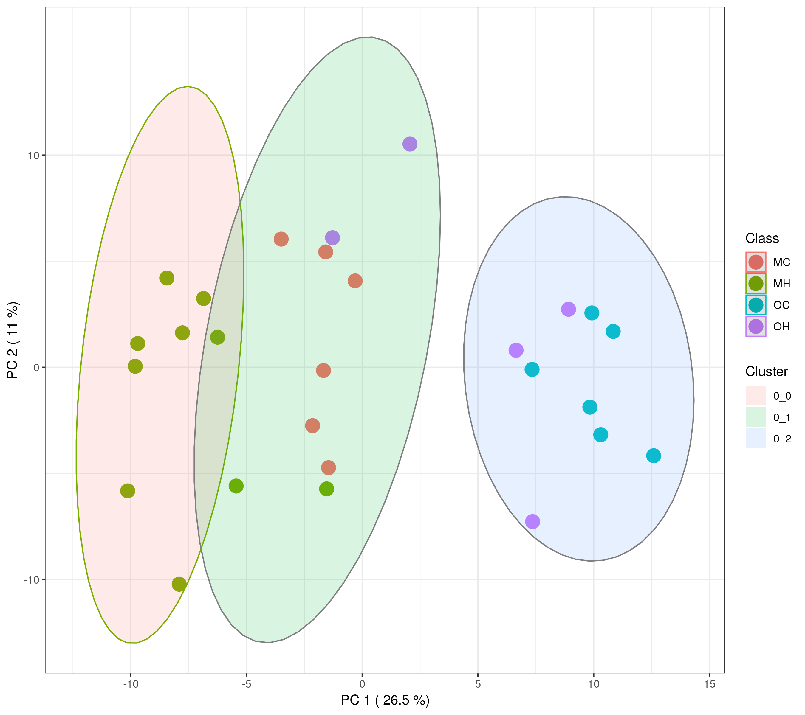

```{r setup, include=FALSE}
knitr::opts_chunk$set(echo = TRUE)
```

```{r echo=FALSE, out.width="49%", fig.show="hold", fig.cap="**Supp Figure 1. Normalized Metabolomic Data.** MetaboAnalyst 5.0 was used to normalize and standardize the metabolomic data in 14 soil samples per horizon."}
knitr::include_graphics(c("Figures/normalized_plots_data.png", "Figures/normalized_metabolite_data2.png"))
```





[**Supp. File 2. Individual Boxplots of all statistically significant metabolites of the mineral horizon**](Figures/Supplemental_mineral_metabolites_plots.pdf)

[**Supp. File 3. Individual Boxplots of all statistically significant lipids of the organic horizon**](Figures/Supplemental_MineralLipids_Boxplots.pdf)

[**Supp. File 4. Individual Boxplots of all statistically significant lipids of the mineral horizon**](Figures/Supplemental_OrganicLipids_Boxplots.pdf)

[**Supplemental Lipid Figures By Class**](Supplemental_Figures_Lipids.html)

[**Functions Script**](Functions.R)

[*Back to Thesis*](Manuscript.html)